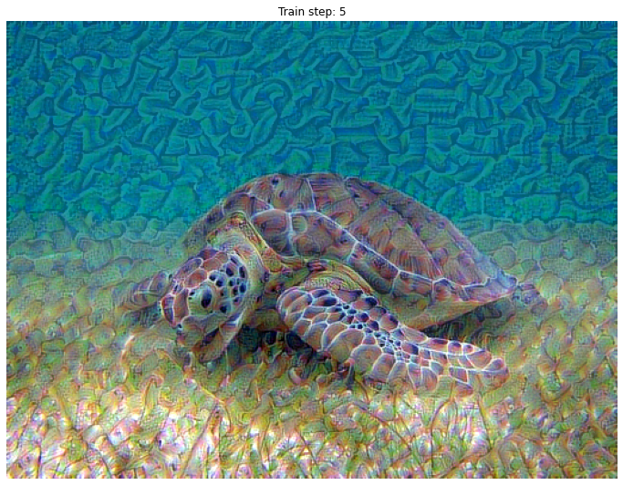

## Artistic Style with Tensorflow2

Load image with ```tf.io.read```_image, which return file byte object. Then ```tf.image.decode_image``` to decode file byte object to tf  tensor. Aware now image value is between 0 and 1. Use ```tf.image.resize(image,new_shape)``` to resize image.

When you want to plot several image in line, use ```plot.subplot(i,i,loc)``` every time you use ```plt.imshow```.

```keras.applications.vgg19.preprocess_input(xxx)``` turns RGB image to BGR one. To get VGG19 model from kears, use ```keras.applications.VGG19(include_top=False, weights="imagenet")``` .

About the model defination. The original model comes from VGG19. To define our model, we will use ```keras.models.Model(inputs, outputs)``` Aware that inputs and outputs are array like and elements in them are tf Tensor.To get input, use ```[vgg.input]``` ,and ```[vgg.get_layer(layer_name).output]``` to get multi output. ```vgg.trainable``` are set to False. As in the whole process, we dont train parameters but we change the input content image every epoch to access our goal.

The vgg we defined above returns raw value of each layer's output, but we wanna process a bit. So we wrap this vgg model with another model outside. This model which wraps vgg inside split the style layers output and content layer output. Then, count the Gram Matrix of each style output.

About the loss computation of the model, we first need to a target that we  want to be. The goal is always to get closer to target. We have style_targets which is the output of style layers while input is style_image, and content_targets which is the output of content layers while input is content_image. To compute loss, use ```tf.add_n([tf.reduce_mean(((output-target) ** 2) for xx in xxx])``` to get style_loss and content_loss. Remember, we just want the style and content output to be more like style and output, that way, we combine the style of the style image to the content image. style_weight and content_weight determines how fast content image get to the style of the style image.

In train_step function,

```
  grad=tape.gradient(loss,image)
  optimizer.apply_gradients([(grad,image)])
  image.assign(clip_0_1(image))
```

